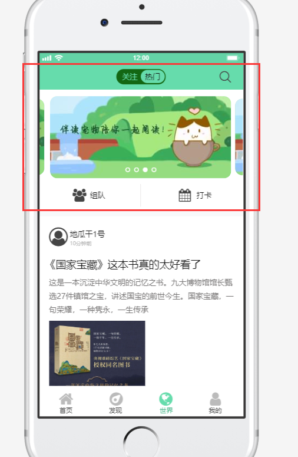
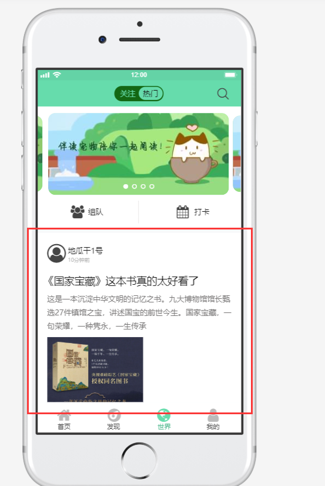
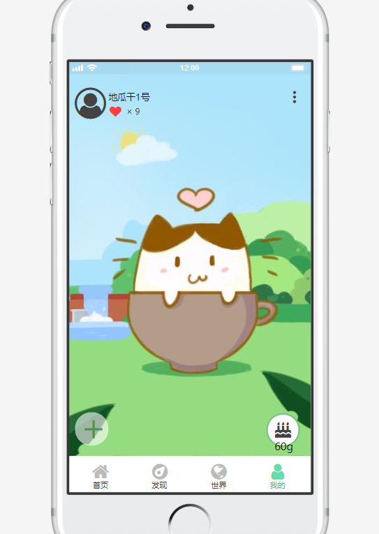
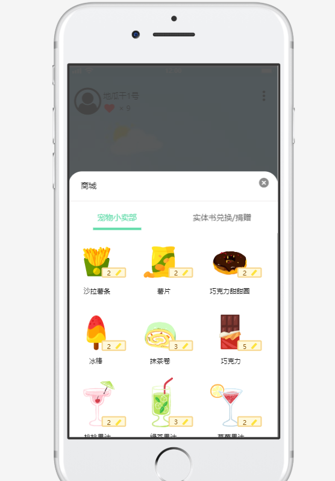
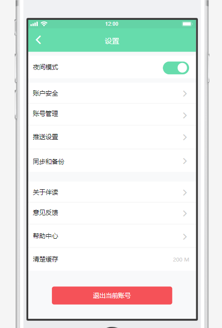
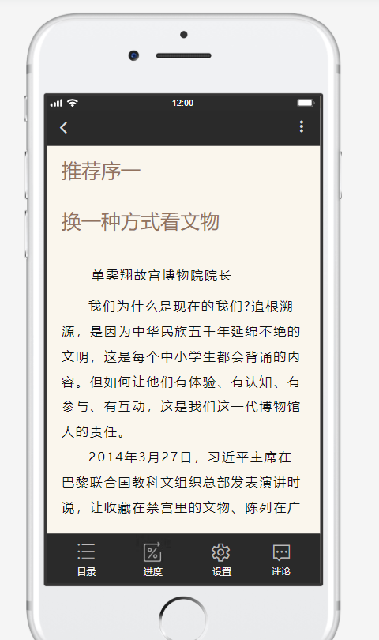
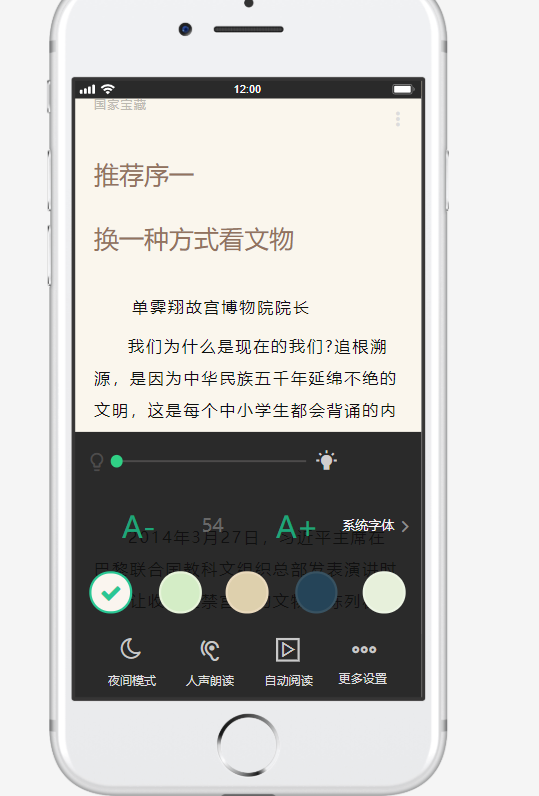

# 任务
> *说明，在效率优先的情况下满足质量，越快越好，实现不了的部分放图片*

## 李彦佳
### 任务1（首要任务：优先级最高）

图一：app壳子，需要下面四个Activity

### 任务2

图一：上半部分，需要仿真设计

图二：书籍list 暂时放图片就行

### 任务3

图一：上半部分，需要滚动设计

图二；今日推荐和相似好书，做静态

### 任务4

图一：上半部分，滚筒设计可以同上复用

图二；list也可以同上复用

## 刘子川

### 任务1

图一：我的界面设计，包括左下角+

图二；商城设计

### 任务2

设置Activity，包括退出和登陆界面

### 任务3

阅读器的简单实现

## 刘佳迎

### 任务1
* 整理已有资源
* 找导师
* 安排一下其他事情
* ..............
* ..............
* ..............
* ..............
* ..............
